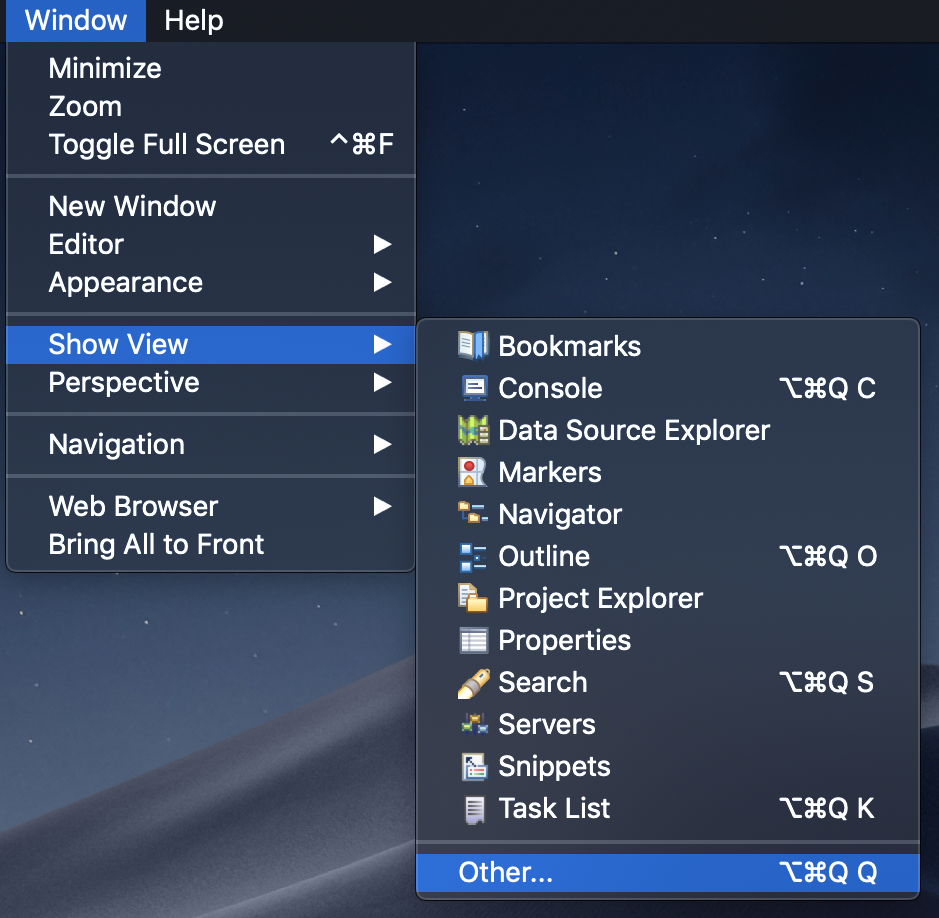
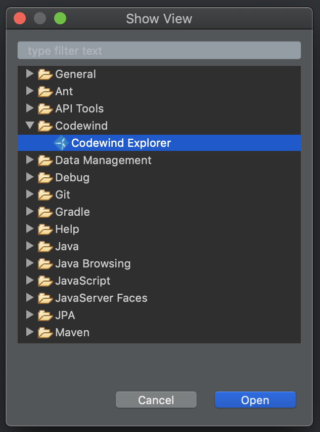
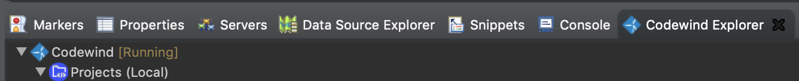
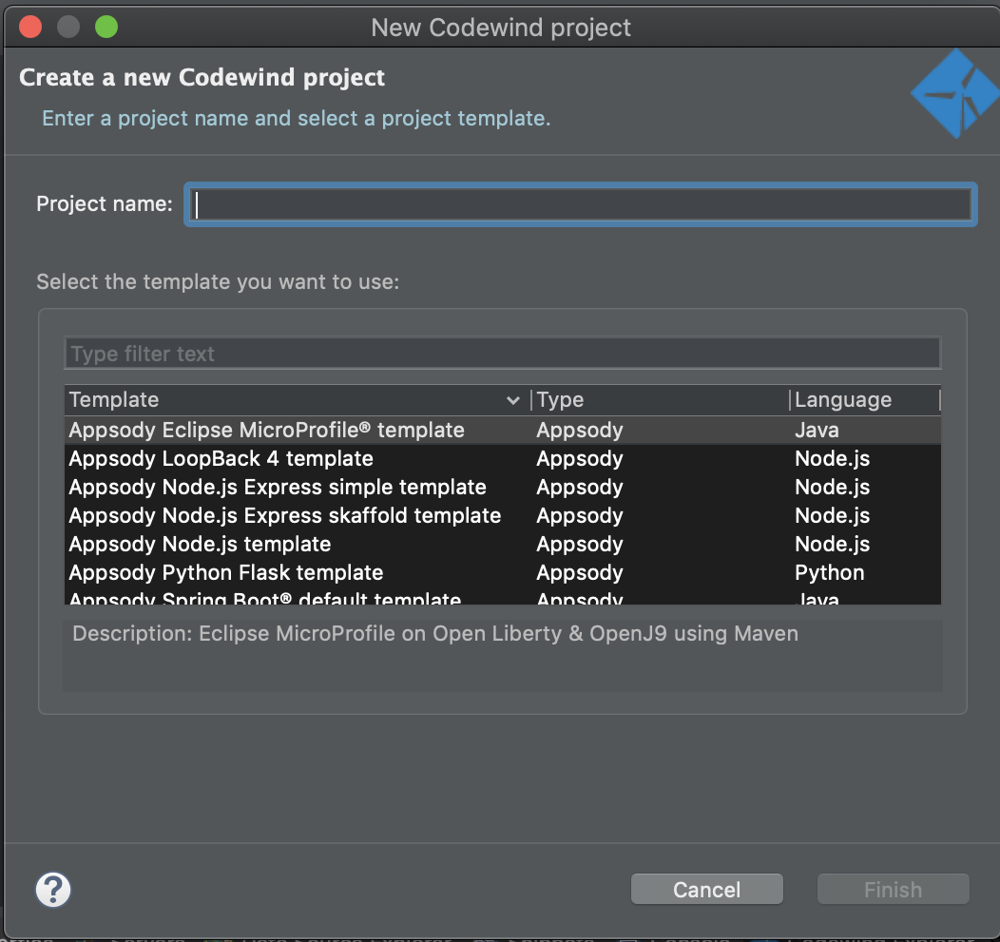
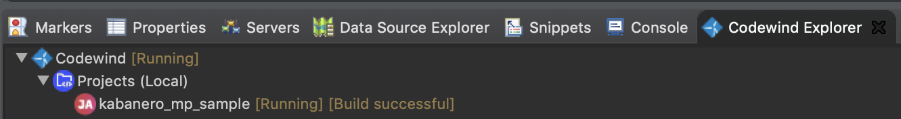
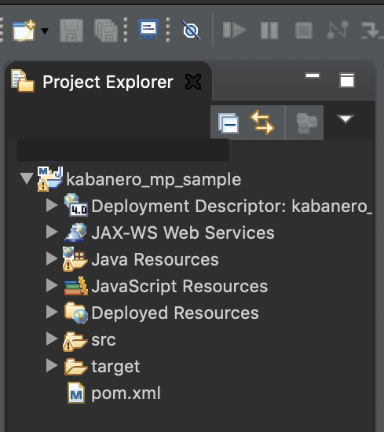

# Kabanero Sample - MicroProfile

## Appsody sample on Codewind

This project is created using Codewind in the Eclipse IDE. For details, refer [Getting started: Codewind for Eclipse](https://www.eclipse.org/codewind/mdteclipsegettingstarted.html).

You can access the codewind explorer as follows.

```
Window > Show View > Other...
```

<p align="center">
    
</p>

It opens a dialog box as follows.

<p align="center">
    
</p>

Choose `Codewind Explorer` and it will show up in Eclpise.

<p align="center">
    
</p>

To create a new project, Right click on the `Projects` > Choose `Create New Project`. You will see something like below.

<p align="center">
    
</p>

Name the project, choose the template you want and click Finish. For this sample, we named it `kabanero_mp_sample` and choose `Appsody Eclipse MicroProfile Template`. Once, the project is successfully created, you will see something like below.

<p align="center">
    
</p>

By refreshing the contents of `Project Explorer`, the project view is also available as follows.

<p align="center">
    
</p>

Various options are available as follows.

<p align="center">
    
</p>

You can open the application in the IDE by using `Open Application` option. Also, the project reloads automatically when you make changes. You can view them by refreshing the browser. You need not re-start the server every time.

## Kabanero Foundation Setup on Minishift

Using Minishift as our environment.

- Start the minishift as follows.

```
minishift config set cpus 6

minishift config set memory 16GB

minishift start --vm-driver=hyperkit
```

You will see something like below once started.

```
Login to server ...
Creating initial project "myproject" ...
Server Information ...
OpenShift server started.

The server is accessible via web console at:
    https://192.168.64.29:8443/console

You are logged in as:
    User:     developer
    Password: <any value>

To login as administrator:
    oc login -u system:admin
```

- Set it to use `oc` cli.

```
eval $(minishift oc-env)
```

To set up `Kabanero Foundation`, follow the below steps.

- Clone the github repo as follows.

```
git clone https://github.com/kabanero-io/kabanero-foundation.git
```

- Go to the `scripts`.

```
cd kabanero-foundation/scripts
```

- Run the script `install-kabanero-foundation.sh` as follows.

```
openshift_master_default_subdomain=<minishift_ip>.nip.io ./install-kabanero-foundation.sh
```

In the above case, it will be `openshift_master_default_subdomain=192.168.64.29.nip.io ./install-kabanero-foundation.sh`

- Once it is successfully installed, you can run `occ get projects` to see what it installed.

```
$ oc get projects
NAME                            DISPLAY NAME   STATUS
istio-system                                   Active
kabanero                                       Active
knative-eventing                               Active
knative-serving                                Active
knative-sources                                Active
```

The above are all installed as part of Kabanero foundation setup.
